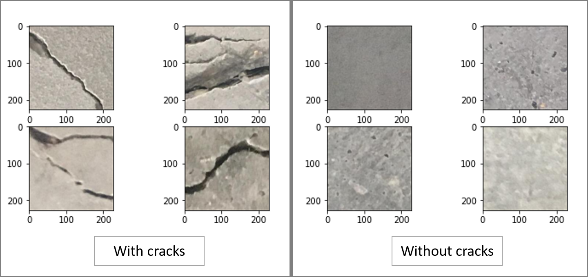

# Concrete Crack Detection Classifier

Identification of cracks on concrete surface with a deep learning Convolutional Neural Network (CNN)

## Data

[Kaggle-dataset](https://www.kaggle.com/arunrk7/surface-crack-detection)

The data set consists of 20,000 images of concrete structures with cracks and 20,000 images without cracks. Each image in the data set is a 227 x 227 pixels RGB image

## Details

I have used the pretrained model Resnet 50 as a starting point and then used transfer learning to train the model. 

To augment training data which helps in better accuracy, I have used Image augmentation such as random rotation, random horizontal and vertical flip as well as random color jitter.

## Result 

